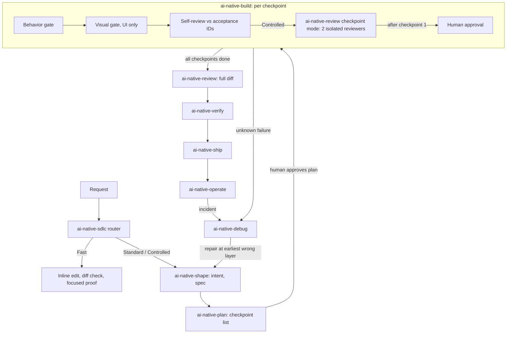

# Architecture

AI-native SDLC is one tree of Markdown skills in `skills/`, and Claude Code and Codex both load it. It contains no executable code. The router skill `ai-native-sdlc` picks a lane (Fast, Standard, or Controlled) and invokes the next leaf skill. Lifecycle state lives in the consuming repository under `.sdlc/changes/<slug>/`, so work resumes from `state.md` without replaying the conversation.

## Lifecycle

A gate that fails sends work back to the layer at fault, and every downstream gate runs again. A fix inside a checkpoint re-runs only the gates it affects.
